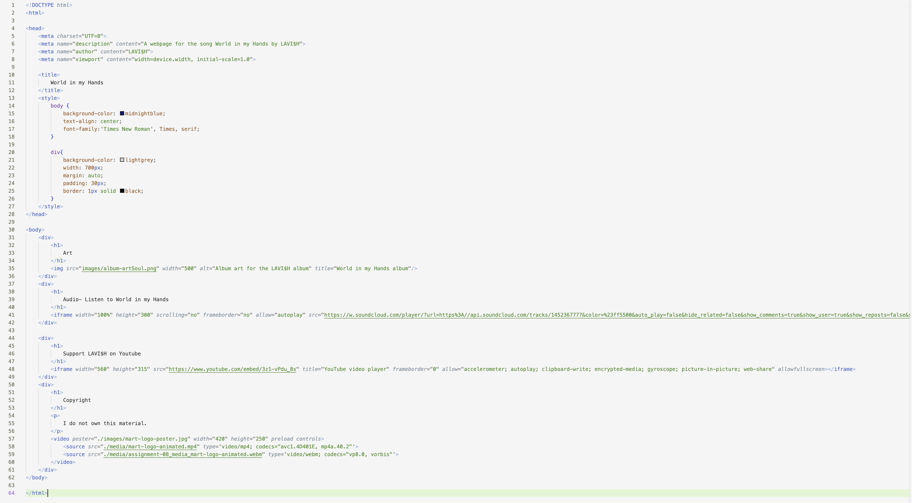

 Q: What is an affordance?
A: An affordance is a clue. They are used with recognizable objects/things to convey how attributes work. A perfect example of an affordance on a website is buttons. The majority of users are very familiar with buttons, what they look like, and what they are used for. By illustrating a button, the user automatically knows what clicking on it will do.  
Q: What are the advantages and disadvantages of using a third-party service like YouTube or Vimeo to host your videos?
A: An advantage to hosting your videos on Youtube is being able to upload as many videos as you want for free. Another pro is when using Youtube you’re accessing an already established website with millions of users. Cons are sharing some of your income with Youtube, following the guidelines and rules set in place, and other politics that come with a large company. 
Q: Optional: What challenges did you face this week with this assignment? How did you overcome them?
A: The first challenge I faced was not being able to access the song I chose on Soundcloud. So I picked a song I had never heard before. I hit another roadblock when I tried to use the YouTube videos. There were only two videos of this song and both wouldn’t show up due to copyright difficulties. I had to either pick another song and rewrite all of my code or hope it was okay that my Youtube links don't play on my website. 

