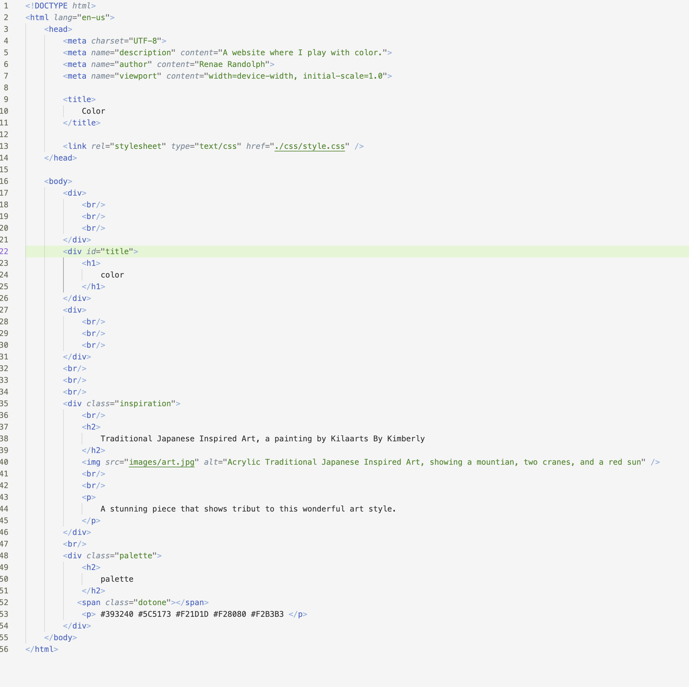

Q: Describe the difference between the universal, element, class, and id selector types. When might you choose one over the other to style content?
A: The universal selector type selects every element on the page. The element type selects the HTML element by name. Class selector type works with specific class attributes. Lastly, id types select specific elements. While you are coding there are times you want to alter the whole website, then you would use universally. As you get more specific when coding different elements, you will move into other types such as id selector type. Each type will work for every stage. Allowing you to fully customize and build the overall webpage. From the overall appearance eventually moving to the smaller details.
Q: Discuss your color palette. How did you choose your colors?
A: The artwork I chose is a nature scene painted in a traditional Japanese style. The image gives me a tranquil feeling, so I tried to recreate this feeling with my colors. I used a lot of light and desaturated colors to let the view relax. I thought the colors I picked were harmonious with the painting, and overall highlighted the soothing energy the painting creates. 
Q: Optional: discuss any challenges you faced this week, and how you overcame them.
A: I faced a very challenging time getting my dots to appear. No matter what I tried, they remained invisible. I hope for future projects I won't run into the problem again. I felt disappointed I couldn’t make my website as wonderful as I had pictured. 

