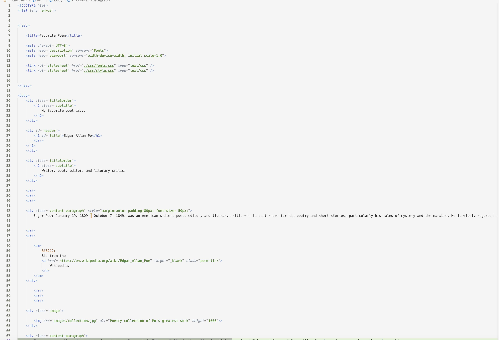

Q: What is typography?
A: Typography is its own art form involving text. How you arrange the letters to form a visually pleasing and legible is the basics of typography. This includes style, appearance, structure, and other attributes of text. 
Q: What is the importance of having fallback fonts or a font stack?
A: Fallback fonts and font stacks are used if the browser is unable to access the primary font; as a result, it will fallback to a similar font. This is important if you are sharing your design over multiple browsers. This often happens to clients, it's vital for your clients to see your work, even if they don’t have the same typeface. 
Q: What is the difference between a system font, web font, and web-safe font?
A: System fonts are fonts that most systems have pre-installed. Such as Arial, Times New Roman, Georgia, and others. Web fonts are those used in a website's design, ones that aren't installed by default. These fonts are designed to work best on the web. Web-safe fonts are used by many developers. They have availability on most systems, letting you easily connect with your client. 
