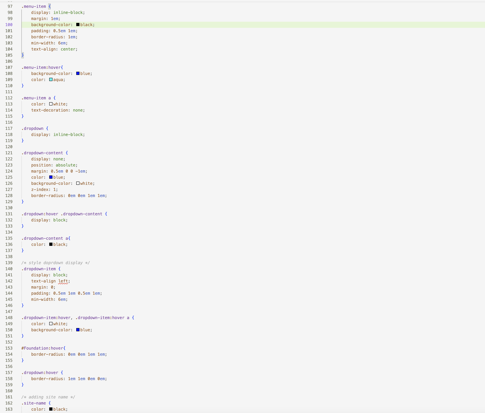

Q: What is the difference between padding, margin, and borders?
A: Padding in web design in the space that is in between the content and an element, specifically the border of an element. This can be used to add more space inside your elements. Margins is the space around the border. This is used to inform the program about how much space you want between your elements and the margin. Lastly, borders are used to separate content on a webpage.  This helps viewers understand your site and the content your provide. 

