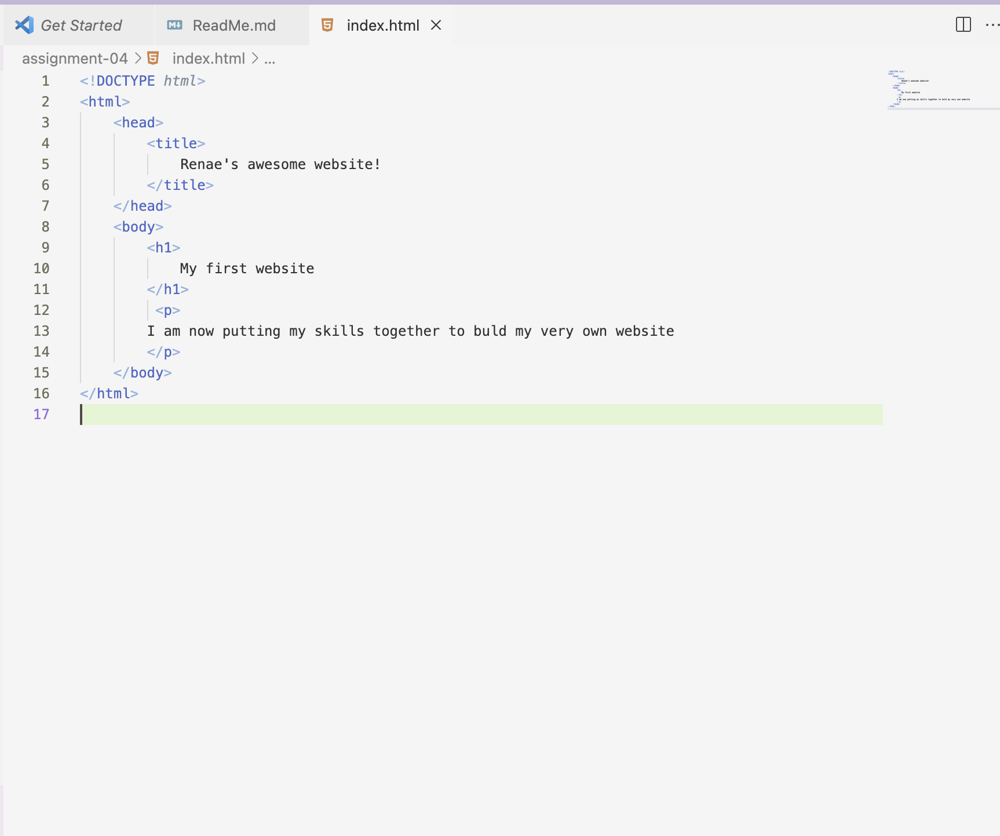

Q: Very briefly detail how browsers function. List any browsers you currently use to surf - or even develop for - the web.
A: Browers are able to work by retreiving infomation from around the web and displaying it on your device. I used to use Safarri as my browser, but switched to Google Chrome many years ago. I find it much easier to use. 

Q: Link to your screenshot using a relative URL.

