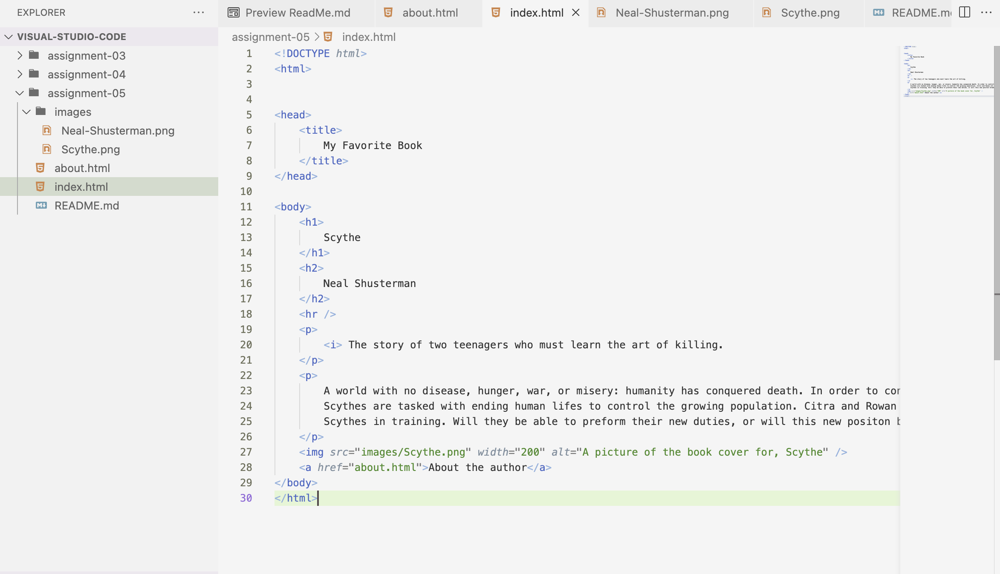

Q: Tell me about a website you visited using The Wayback Machine. What year was it from? How is the older version different from the new version in terms of its overall design?
A: I decied to use the Wayback Machine to veiw Youtube in 2005. The biggest diffrence in design is the lack of color. Modern Youtube the videos tak up most of the screen, each thumbnail is a diffren color, letting the home screen light up in vibrancy. Youtube of 2005 had very dull thumbnails, and they were much smaller. The other diffrence is the lack of options, only home, video, channel, and upload as options. Compared to 2023 with playlists, dowloads, shorts, library, history, movies, shows, and more. 

Link to your screenshot using a relative URL:
