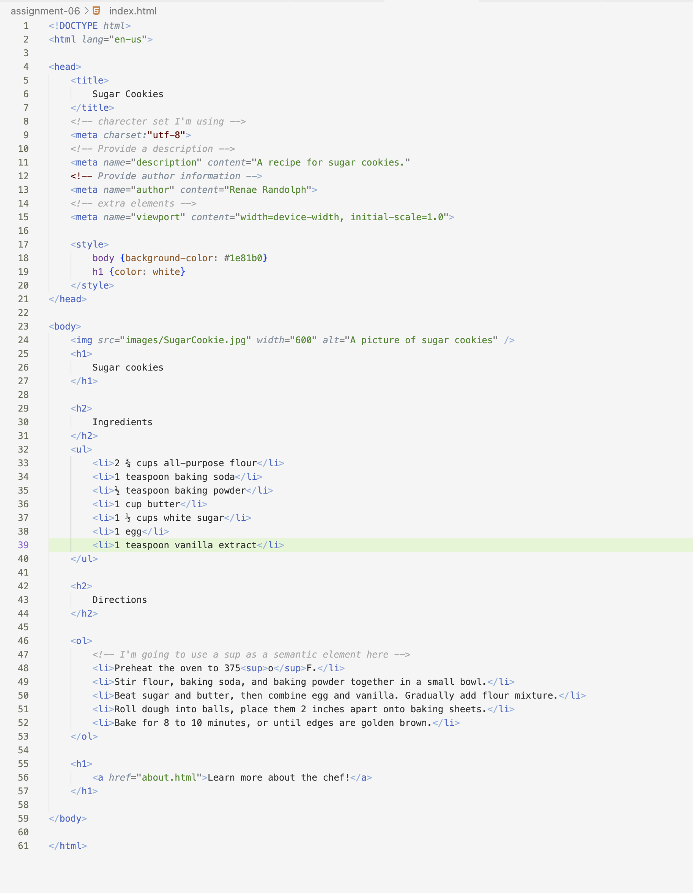

Q: Describe the difference between semantic and structural markup.

Semantic markup is used to visualise to meaning of the information. By higlighting, bolding, italicize, underline and others. You can emphasis the words and information you are putting into your code.
Structural markup is used to form the structure of the document. Such as headings, lists, parapgraphs, breaks, and others. Using these elemtns organises your information to help the viewer navigate it. 

