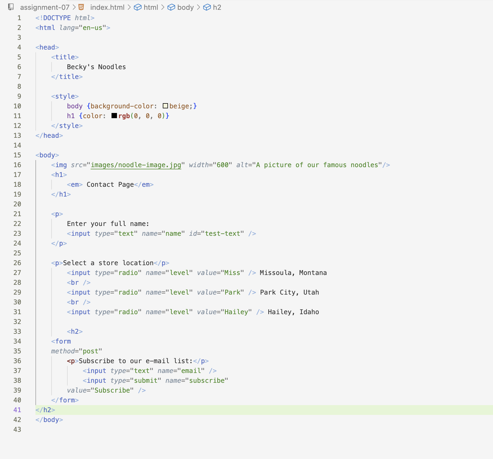

Q: describe any forms you've come across while browsing the web. What purposes do they serve?
A: The most common input form I have come across is the upload button. On Moodle, the upload button is very most important, as it allows you to submit your work. On Youtube, the upload buttons let people upload their videos. When purchasing something on Amazon, you are given the choice of either the add to cart button or the buy now button. When you join a new website, the sing in or sign up button gives you access to the content. I feel you can find an upload button on the majority of websites.

